# simple Animation with LCD

 
This is a sample animation character, I'm Draw this character by writing in LCD's CGRAM,

and send the data i wrote it to display on LCD by SendData function.

==============================================================================

## I used:
### Hardware:
1. ATmega 32 Microcontroller.
2. Character LCD Display **Model LMB1602A**

### Software:
1. DIO Driver
2. LCD Driver

==============================================================================
 
## Brief

This animation is a Fun story of Imaginary character I called Him **HAMOKSHA**

### In the first

you will see **Hamoksha Story** displayed on LCD
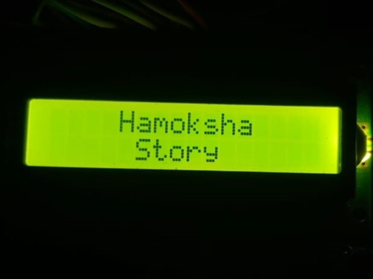

### Then

you will see **Hamoksha wellcome** 
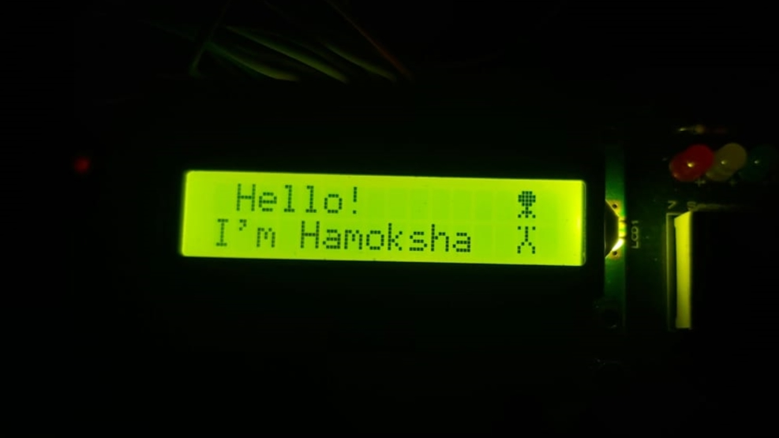

### Then 

What can he do

**Playing Football**
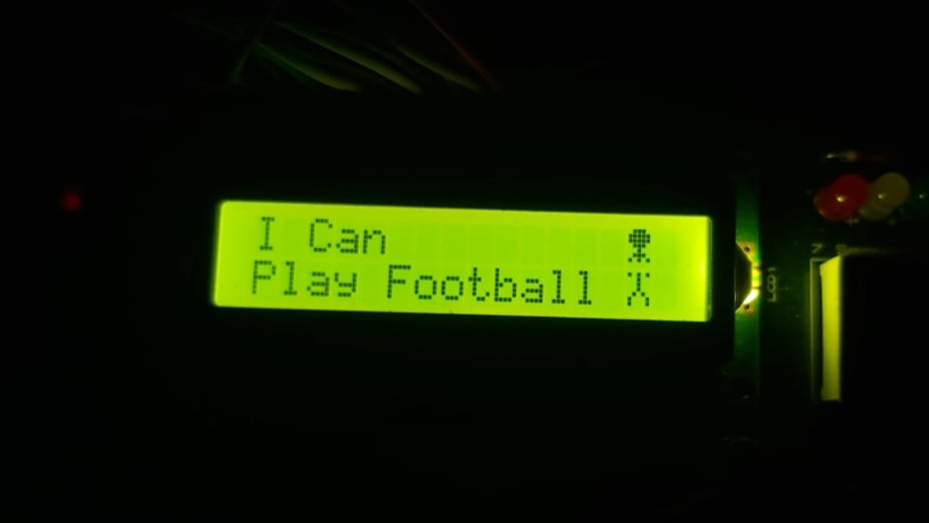
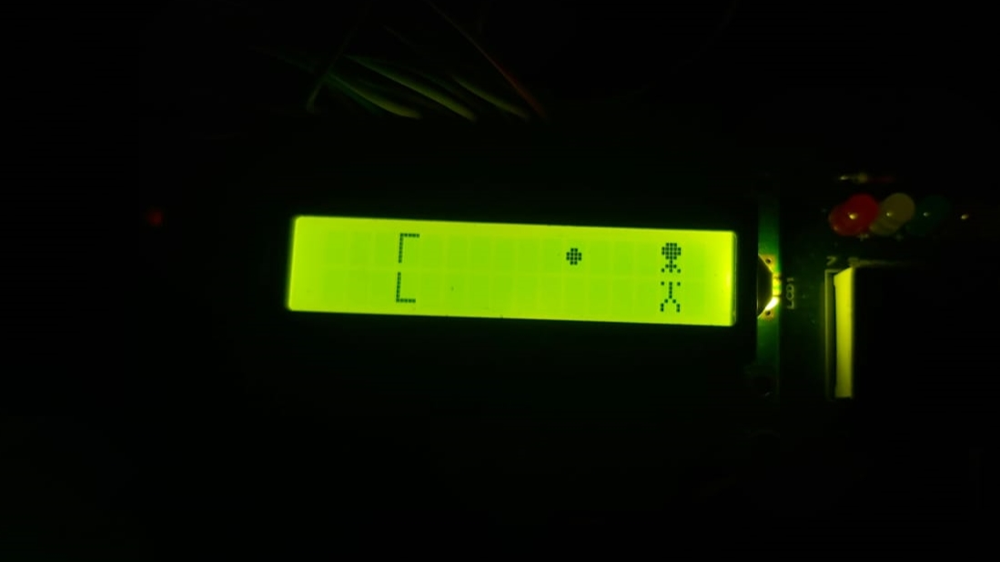
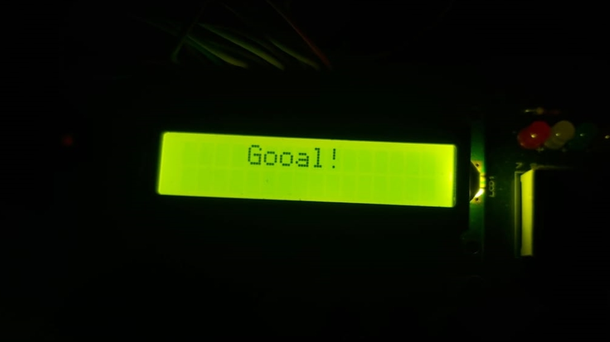

**Running**
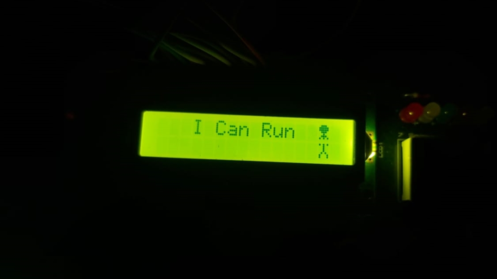
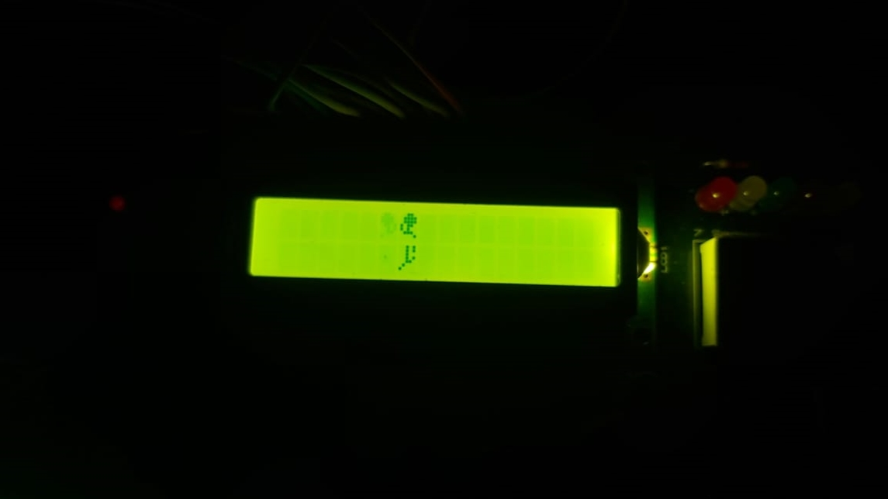

**Dancing**
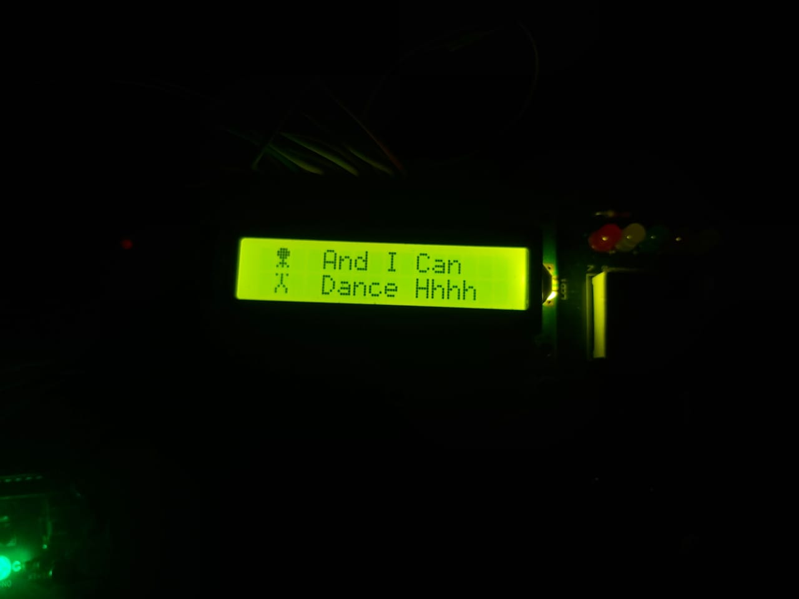
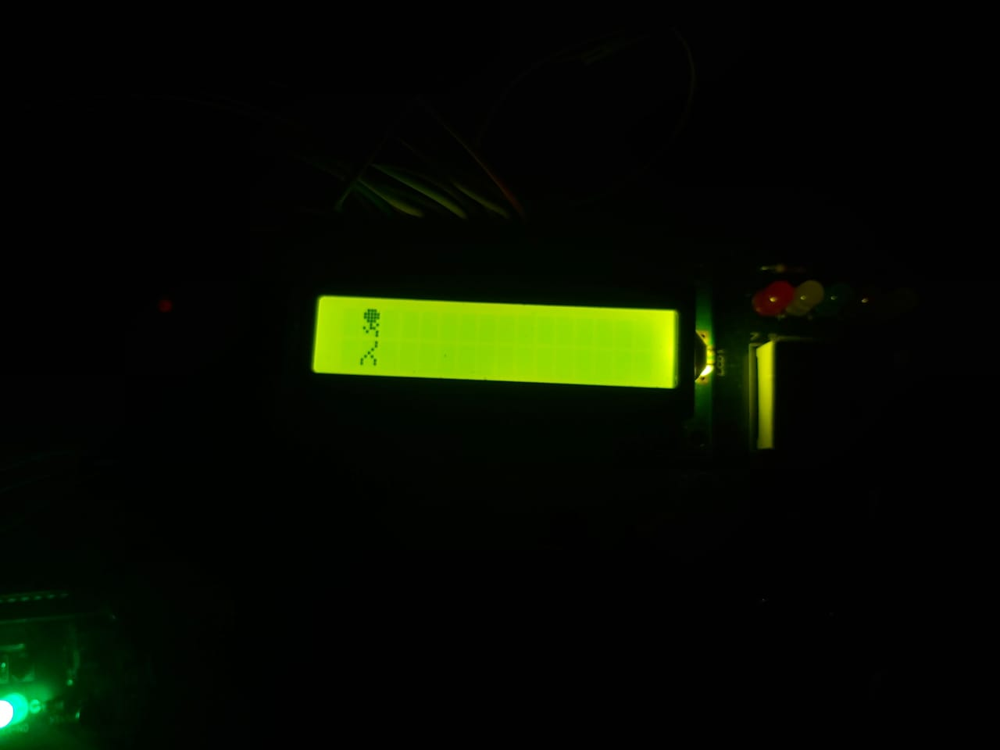

### Then

Hamoksha will die
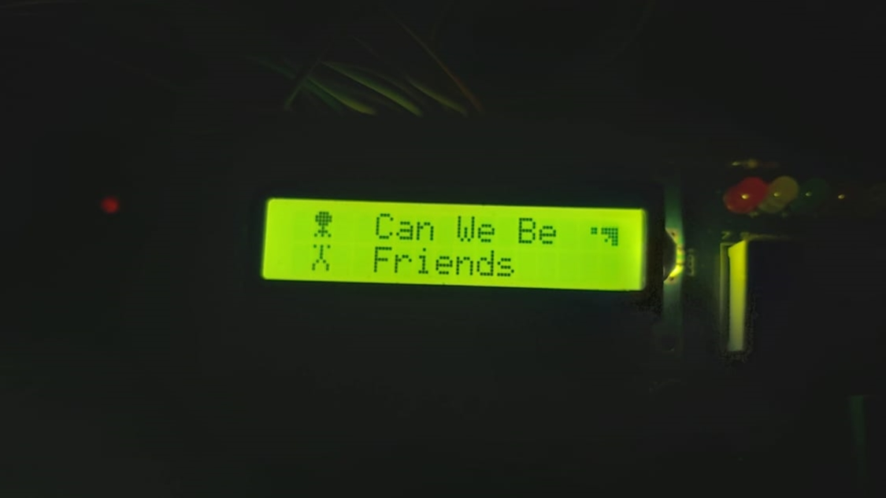
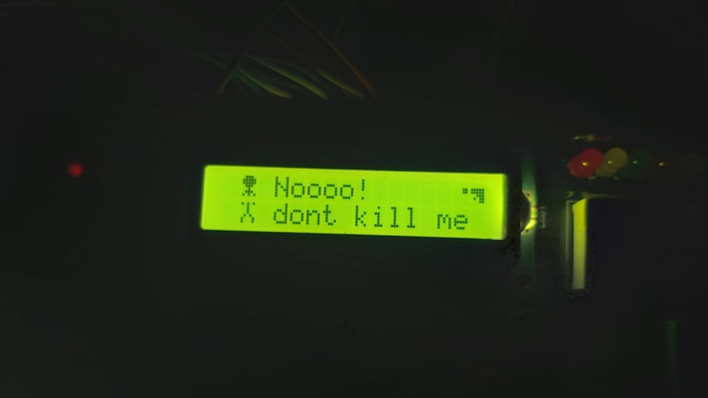
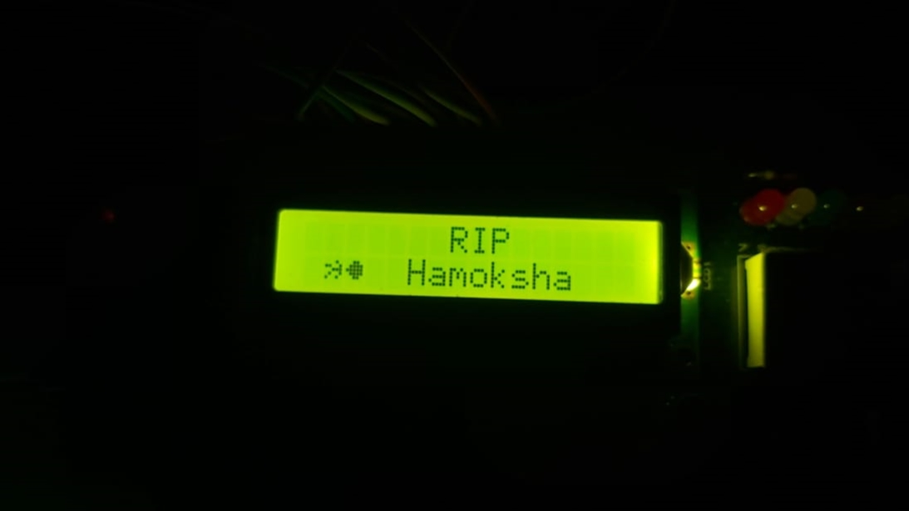

==============================================================================

### You can see the fall Hamoksha Vedio from here

[vido](https://www.linkedin.com/posts/alhasansharafeddeen_lcddisplay-embedded-c-activity-6935703026846351360-2a7l?utm_source=linkedin_share&utm_medium=member_desktop_web)

==============================================================================

**Thanks for reading**

