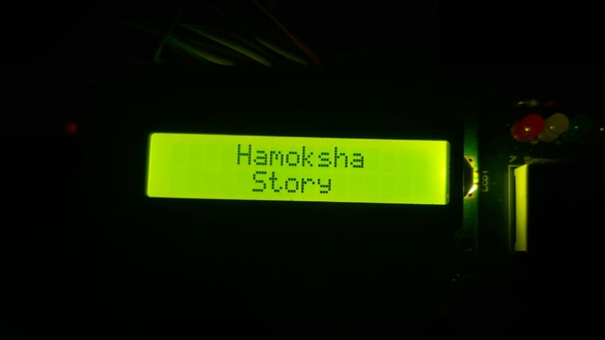

# simple Animation with LCD

 
This is a sample animation character, I'm Draw this character by writing in LCD's CGRAM,

and send the data i wrote it to display on LCD by SendData function.

==============================================================================

## I used:
### Hardware:
1. ATmega 32 Microcontroller.
2. Character LCD Display **Model LMB1602A**

### Software:
1. DIO Driver
2. LCD Driver

==============================================================================
 
## Brief

This animation is a Fun story of Imaginary character I called Him **HAMOKSHA**

# In the first

you will see **Hamoksha Story** displayed on LCD

